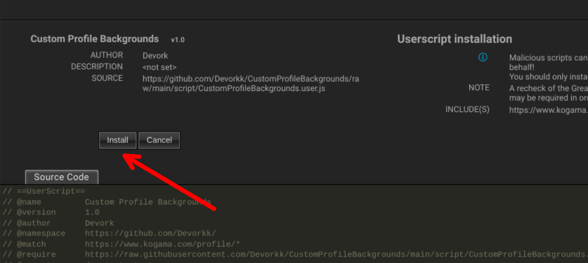

# What are user scripts?
User scripts put you in control of your browsing experience. Once installed, they automatically make the sites you visit better by adding features, making them easier to use, or taking out the annoying bits. The user scripts on Greasy Fork were written by other users and posted to share with the world. They're free to install and easy to use.

# Step 1: install a user script manager

To use user scripts you need to first install a user script manager. Which user script manager you can use depends on which browser you use.

- Chrome: [Tampermonkey](https://chrome.google.com/webstore/detail/tampermonkey/dhdgffkkebhmkfjojejmpbldmpobfkfo) or [Violentmonkey](https://chrome.google.com/webstore/detail/violentmonkey/jinjaccalgkegednnccohejagnlnfdag)  
- Firefox: [Greasemonkey](https://addons.mozilla.org/en-US/firefox/addon/greasemonkey/), [Tampermonkey](https://addons.mozilla.org/en-US/firefox/addon/tampermonkey/), or [Violentmonkey](https://addons.mozilla.org/en-US/firefox/addon/violentmonkey/)  
- Safari: [Tampermonkey](https://www.tampermonkey.net/?browser=safari) or [Userscripts](https://apps.apple.com/app/userscripts/id1463298887)
- Microsoft Edge: [Tampermonkey](https://microsoftedge.microsoft.com/addons/detail/tampermonkey/iikmkjmpaadaobahmlepeloendndfphd) or [Violentmonkey](https://microsoftedge.microsoft.com/addons/detail/violentmonkey/eeagobfjdenkkddmbclomhiblgggliao)
- Opera: [Tampermonkey](https://addons.opera.com/en/extensions/details/tampermonkey-beta/) or [Violentmonkey](https://violentmonkey.github.io/get-it/)
- Maxthon: [Violentmonkey](https://extension.maxthon.com/detail/index.php?view_id=1680)

# Step 2: install a user script

Once you've found a user script, you can download one of my scripts and your user script manager will ask you to confirm the install, then you are ready to use it.

Source: [GreasyFork](https://greasyfork.org/)
